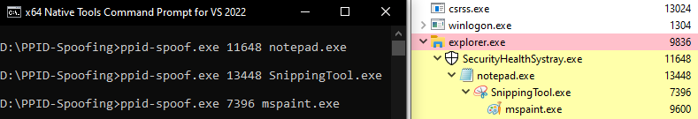
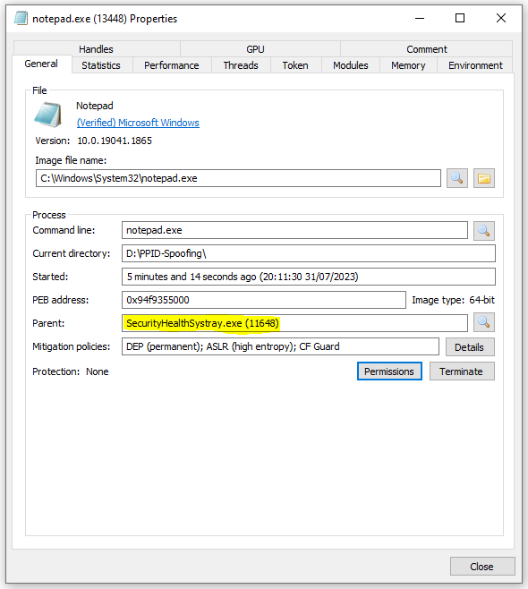

# PPID-Spoof
Simple parent process spoofer written in C.

# PPID Spoofing
On a high level, Parent Process ID (PPID) spoofing is a technique employed by malicious processes to deceive and evade.
It involves altering the genuine PPID from the process that spawned it into a more favorable and less suspicious parent.

For example, if `excel.exe` spawns `powershell.exe`, that's immediate cause for concern [and will likely be detected](https://www.elastic.co/guide/en/security/current/suspicious-ms-office-child-process.html#_rule_query_672).
A better alternative would be to send a runner to spawn `powershell.exe` elsewhere, under a far less suspicious parent process.

On a lower level, PPID spoofing is enabled by the `lpAttributeList` member of the [STARTUPINFOEXA](https://learn.microsoft.com/en-us/windows/win32/api/winbase/ns-winbase-startupinfoexa) structure.
This structure is required by [CreateProcessA](https://learn.microsoft.com/en-us/windows/win32/api/processthreadsapi/nf-processthreadsapi-createprocessa) when spawning a new process in the `lpStartupInfo` parameter.

After initializing the attribute list, the [UpdateProcThreadAttribute](https://learn.microsoft.com/en-us/windows/win32/api/processthreadsapi/nf-processthreadsapi-updateprocthreadattribute) function can be used
to apply various different attributes to the process being spawned, among those attributes is `PROC_THREAD_ATTRIBUTE_PARENT_PROCESS` in which a handle to the target process can be provided to be set as the parent.

# Compilation
Run `compile.bat` in the x64 Native Tools Command Prompt.

# Usage
ppid-spoof.exe \<PID\> \<EXE\> 

# References
[ired.team](https://www.ired.team/offensive-security/defense-evasion/parent-process-id-ppid-spoofing)
[TrustedSec](https://www.trustedsec.com/blog/ppid-spoofing-its-really-this-easy-to-fake-your-parent/)
[Elastic](https://www.elastic.co/guide/en/security/current/unusual-parent-child-relationship.html)
